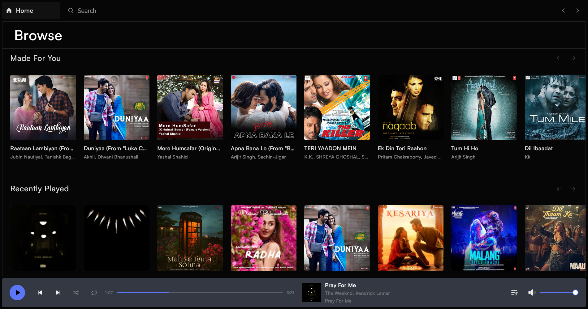
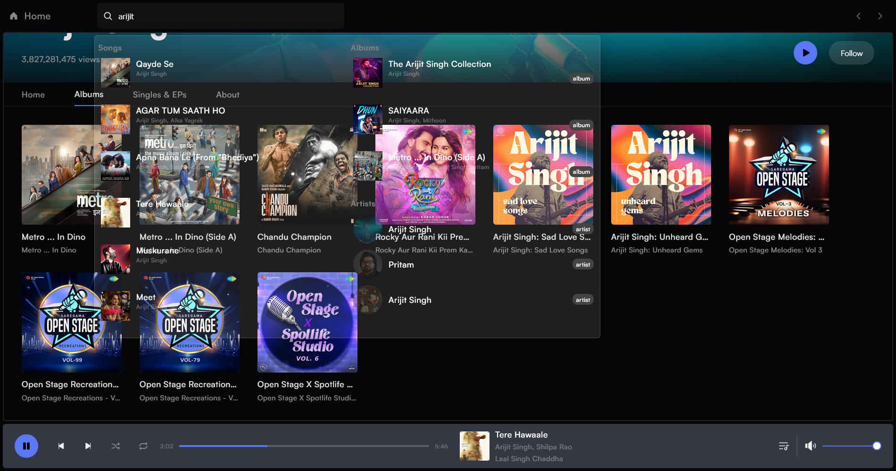
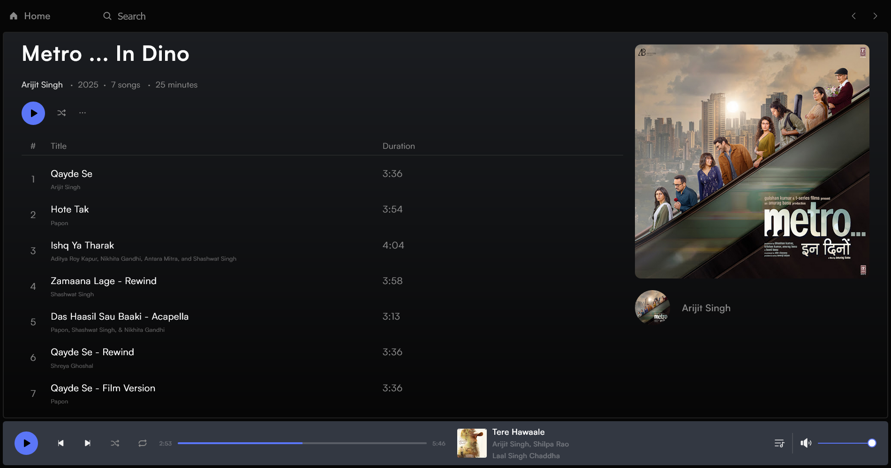
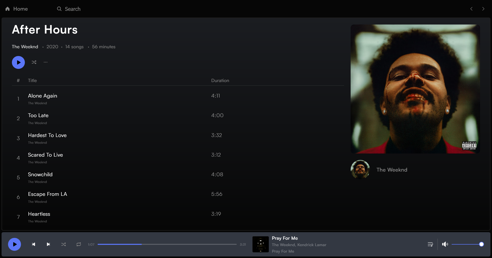
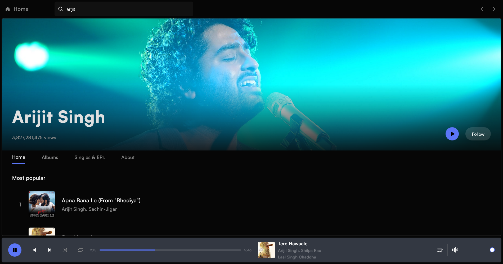
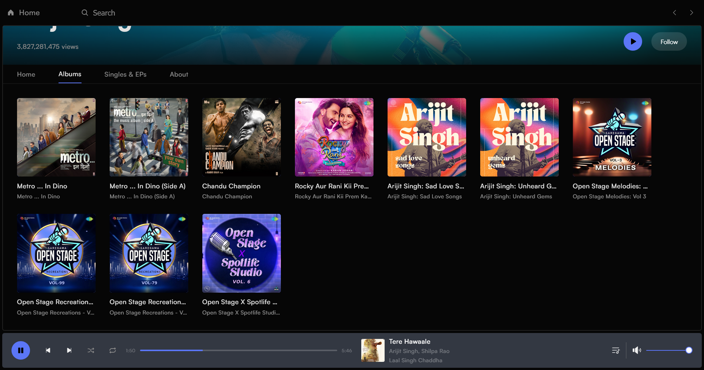
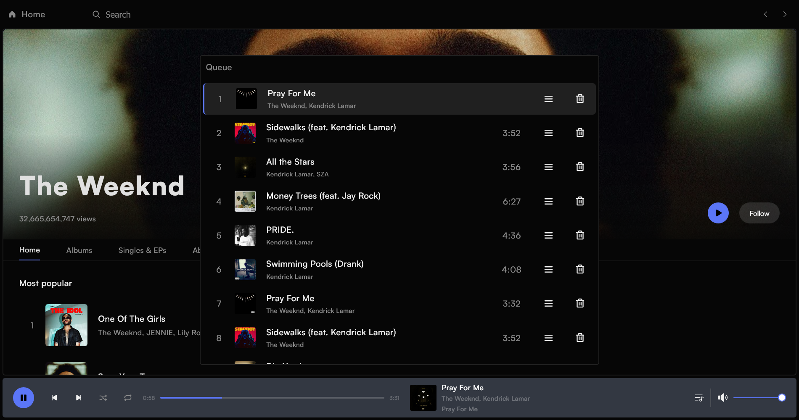

# 🎧 Vox – Your Personal Music Streaming Website

Vox is a full-stack music streaming web app inspired by platforms like Spotify, YouTube Music, and Apple Music.  
Built with ❤️ using modern tools and technologies, it provides a clean UI, search, audio streaming, and more.

---

## 📸 Screenshots






.png)



## 🔥 Features

- 🎵 Stream music directly using `yt-dlp`
- 🏠 Clean & interactive homepage
- 🔍 Album, Song, and Artist detail pages
- 🎶 Music player with shuffle, loop, queue
- 🕒 Recently played songs tracking
- 🎨 Dynamic UI & responsive design (laptop only)
- ✅ Playlist creation system _(under development)_
- 🔒 Small screen block (responsive blocker for mobiles)

---

## 🛠 Tech Stack

### 🔹 Frontend

- React JS (Vite)
- React Router DOM
- HTML5 + CSS3
- LocalStorage for caching
- Media Queries & custom design

### 🔹 Backend

- Flask (Python)
- yt-dlp (for YouTube music stream data)
- Flask-CORS
- JSON parsing & custom APIs

---

## ⚙️ Installation (Local Development)

```
🔹 1. Clone this repo

git clone https://github.com/NilanshuGarhewal/Vox-v1.git
cd vox

🔹 2. Frontend setup

cd frontend
npm install
npm run dev

🔹 3. Backend setup

cd backend
pip install -r requirements.txt
python app.py

🔹 4. Access

Frontend: http://localhost:5173
Backend: http://localhost:10000
```

### 🧠 Folder Structure

```
vox/
├── backend/
│   ├── app.py
│   ├── requirements.txt
│   └── .render.yaml
├── frontend/
│   ├── src/
│   ├── index.html
│   ├── vite.config.js
│   └── package.json
```

### 📦 Notable Packages Used

Frontend
react-router-dom
vite
react-icons
axios

Backend
Flask
yt-dlp
Flask-CORS
json / os

### ⚠️ Known Issues

Mobile responsiveness intentionally blocked (feature)

Playlist view feature under construction

### 📌 Future Plans

✅ User login & auth

✅ Playlist management with cover art

✅ Better song recommendation using AI

✅ Mobile support

✅ Custom audio engine enhancements

### 🤝 Contributing

PRs welcome!
Feel free to fork, improve, and submit pull requests.

### 📜 License

This project is licensed under MIT – free to use, modify & share.

### 🧑‍💻 Developed By

Nilanshu Garhewal
🎶 Music Producer | 💻 Coder | 🧠 Creator
GitHub | Instagram
